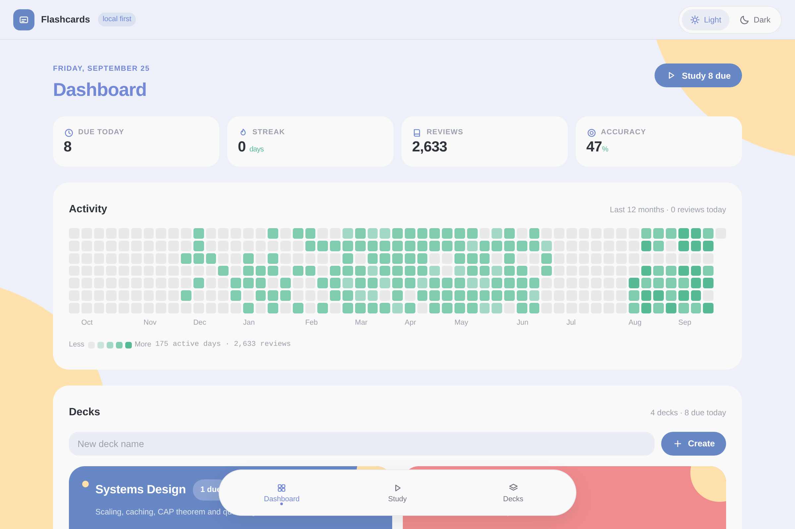
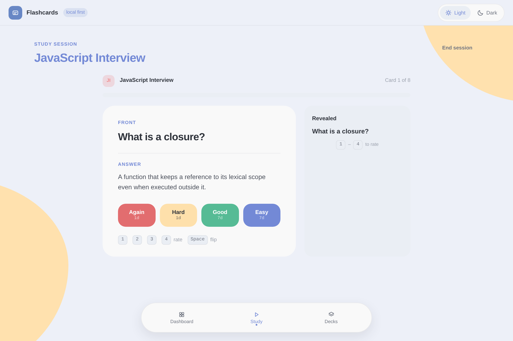
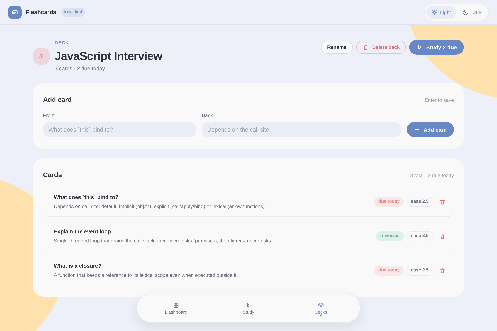

# Flashcards

A modern, cross-platform flashcard application with GitHub-style activity heatmap and centralized sync server. Built as an MVP with offline-first architecture.

## Features (MVP)

- **Decks & Cards**: Create decks and add front/back cards
- **SRS Study**: Simple spaced repetition with 1/3/7/14/30/60/120 day intervals
- **Activity Heatmap**: Visualize your daily review streaks (GitHub-style)
- **Offline-First**: All data stored locally in SQLite; study without internet
- **Cross-Device Sync**: Sync decks, cards, and review logs to a central Node.js/PostgreSQL server
- **Cross-Platform**: Electron app for Linux, Windows, and macOS (Android via Capacitor planned)

## Architecture

```
flashcards/
├── apps/
│   ├── desktop/       # Electron + React + Vite + better-sqlite3 (local DB)
│   └── server/        # Node.js + Express + Prisma + PostgreSQL (central sync)
├── packages/
│   └── shared/        # Zod schemas & TypeScript types shared across client/server
├── docker-compose.yml # PostgreSQL + server for local development
└── README.md
```

## Prerequisites

- Node.js 20+
- pnpm 9+
- Docker & Docker Compose (for PostgreSQL)

## Setup

### 1. Install dependencies

```bash
pnpm install
```

### 2. Start PostgreSQL

```bash
docker compose up -d postgres
```

### 3. Configure server

```bash
cp apps/server/.env.example apps/server/.env
# Edit apps/server/.env if needed (defaults work with docker compose)
```

### 4. Run database migrations & seed

```bash
pnpm db:generate
pnpm db:migrate
pnpm db:seed
```

### 5. Start the server

```bash
pnpm dev:server
```

The server will run on `http://localhost:4000`.

### 6. Start the desktop app

In a new terminal:

```bash
cp apps/desktop/.env.example apps/desktop/.env
pnpm dev:desktop
```

The app window will open. It communicates with `http://localhost:4000` for sync.

## Build for Production

### Desktop

```bash
pnpm build:desktop
```

This produces installers in `apps/desktop/release/`:
- `.AppImage` for Linux
- `.exe` installer for Windows
- `.dmg` for macOS

### Server

```bash
pnpm build:server
node apps/server/dist/index.js
```

## Sync Flow

1. All reads/writes happen against the local SQLite database (`~/.flashcards/flashcards.db`).
2. The sync service collects local changes since `lastSyncedAt` and sends them to `/sync`.
3. The server applies client changes (last-write-wins) and returns any newer server changes.
4. The client applies server changes to its local DB and updates `lastSyncedAt`.

## Screenshots

| Dashboard (activity heatmap) | Study | Deck editor |
| --- | --- | --- |
|  |  |  |

Captured headlessly from the real renderer build (no display needed) with
`tools/screenshot` — see [tools/screenshot/README.md](tools/screenshot/README.md).

## Tech Stack

| Layer        | Technology                          |
|--------------|-------------------------------------|
| Desktop UI   | Electron, React, Vite               |
| Local DB     | better-sqlite3 (SQLite)             |
| Sync Server  | Node.js, Express, Prisma            |
| Central DB   | PostgreSQL                          |
| Validation   | Zod                                 |
| Package Mgr  | pnpm workspaces                     |

## Roadmap

- [ ] SM-2 algorithm instead of fixed intervals
- [ ] Image/audio attachments
- [ ] Dark mode & theming
- [ ] Notifications & daily reminders
- [ ] Import/export Anki decks
- [ ] Android build via Capacitor
- [ ] Real-time sync with WebSockets

## License

MIT
